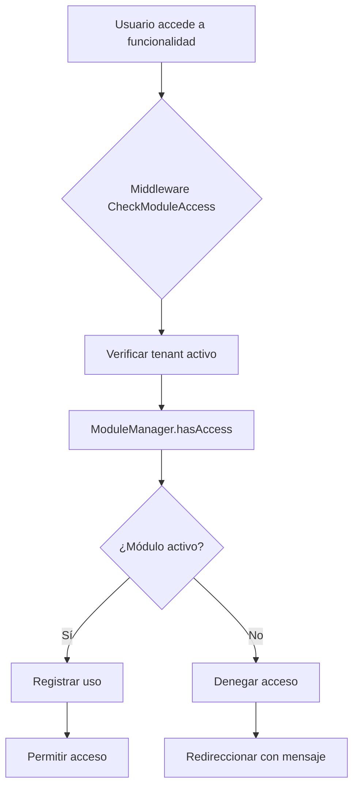

# 🏗️ Sistema Modular CrecePyme - Documentación Técnica

## 📋 Índice
1. [Introducción](#introducción)
2. [Arquitectura del Sistema](#arquitectura-del-sistema)
3. [Estructura de Base de Datos](#estructura-de-base-de-datos)
4. [Creación de Módulos](#creación-de-módulos)
5. [Gestión de Dependencias](#gestión-de-dependencias)
6. [Sistema de Permisos](#sistema-de-permisos)
7. [API y Servicios](#api-y-servicios)
8. [Middleware y Seguridad](#middleware-y-seguridad)
9. [Helpers y Utilidades](#helpers-y-utilidades)
10. [Testing](#testing)
11. [Deployment](#deployment)

## 🎯 Introducción

El Sistema Modular de CrecePyme transforma la aplicación de un monolito a una suite empresarial escalable donde las funcionalidades se organizan en módulos independientes que pueden ser activados/desactivados por tenant.

### Características Principales
- ✅ **Modularidad**: Funcionalidades aisladas por módulo
- ✅ **Multi-tenancy**: Configuración independiente por empresa
- ✅ **Escalabilidad**: Modelo SaaS con planes y precios
- ✅ **Seguridad**: Control de acceso granular
- ✅ **Flexibilidad**: Dependencias y configuración por módulo

## 🏛️ Arquitectura del Sistema

### Componentes Principales

```
┌─────────────────────────────────────────────────────────────┐
│                    CRECEPYME SUITE                          │
├─────────────────────────────────────────────────────────────┤
│                     Admin Panel                            │
│              (Gestión de Módulos)                          │
├─────────────────────────────────────────────────────────────┤
│                   ModuleManager                            │
│            (Cerebro del Sistema)                           │
├─────────────────────────────────────────────────────────────┤
│  Core │ Finance │ Sales │ Operations │ HR │ Analytics      │
│       │         │       │            │    │                │
│ Auth  │Invoice  │ CRM   │ Inventory  │HRM │ BI Dashboard   │
│ Users │Payment  │Quote  │ Suppliers  │    │ Reports        │
│ Config│Banking  │E-comm │ POS        │    │                │
└─────────────────────────────────────────────────────────────┘
```

### Flujo de Verificación de Acceso



## 🗄️ Estructura de Base de Datos

### Tablas Principales

#### `system_modules`
```sql
CREATE TABLE system_modules (
    id BIGINT PRIMARY KEY,
    code VARCHAR(50) UNIQUE,           -- 'invoicing', 'hrm', etc.
    name VARCHAR(255),                 -- 'Facturación Electrónica'
    description TEXT,
    version VARCHAR(20),               -- '1.0.0'
    category VARCHAR(50),              -- 'finance', 'sales', etc.
    dependencies JSON,                 -- ['core', 'tenancy']
    settings_schema JSON,              -- Esquema de configuración
    is_core BOOLEAN DEFAULT FALSE,     -- No se puede desactivar
    is_active BOOLEAN DEFAULT TRUE,
    base_price DECIMAL(10,2),         -- Precio mensual base
    icon VARCHAR(50),                 -- Icono para UI
    color VARCHAR(7),                 -- Color hex
    sort_order INTEGER DEFAULT 0,
    features JSON,                    -- Lista de características
    permissions JSON,                 -- Permisos que otorga
    created_at TIMESTAMP,
    updated_at TIMESTAMP
);
```

#### `tenant_modules`
```sql
CREATE TABLE tenant_modules (
    id BIGINT PRIMARY KEY,
    tenant_id UUID REFERENCES tenants(id),
    module_id BIGINT REFERENCES system_modules(id),
    is_enabled BOOLEAN DEFAULT TRUE,
    enabled_at TIMESTAMP,
    disabled_at TIMESTAMP,
    expires_at TIMESTAMP,              -- Para períodos de prueba
    settings JSON,                     -- Configuración específica
    usage_stats JSON,                 -- Estadísticas de uso
    custom_price DECIMAL(10,2),       -- Precio personalizado
    billing_cycle VARCHAR(20) DEFAULT 'monthly',
    created_at TIMESTAMP,
    updated_at TIMESTAMP,
    UNIQUE(tenant_id, module_id)
);
```

#### `subscription_plans`
```sql
CREATE TABLE subscription_plans (
    id BIGINT PRIMARY KEY,
    name VARCHAR(255),                 -- 'Professional'
    code VARCHAR(50) UNIQUE,           -- 'professional'
    description TEXT,
    monthly_price DECIMAL(10,2),
    annual_price DECIMAL(10,2),
    included_modules JSON,             -- Módulos incluidos
    limits JSON,                       -- Límites del plan
    features JSON,                     -- Características
    is_active BOOLEAN DEFAULT TRUE,
    is_popular BOOLEAN DEFAULT FALSE,
    trial_days INTEGER DEFAULT 14,
    sort_order INTEGER DEFAULT 0,
    created_at TIMESTAMP,
    updated_at TIMESTAMP
);
```

#### `tenant_subscriptions`
```sql
CREATE TABLE tenant_subscriptions (
    id BIGINT PRIMARY KEY,
    tenant_id UUID REFERENCES tenants(id),
    plan_id BIGINT REFERENCES subscription_plans(id),
    status VARCHAR(20),                -- 'active', 'trial', 'cancelled'
    started_at TIMESTAMP,
    trial_ends_at TIMESTAMP,
    current_period_start TIMESTAMP,
    current_period_end TIMESTAMP,
    cancelled_at TIMESTAMP,
    custom_modules JSON,               -- Módulos adicionales
    custom_limits JSON,                -- Límites personalizados
    monthly_amount DECIMAL(10,2),
    billing_cycle VARCHAR(20) DEFAULT 'monthly',
    payment_method VARCHAR(50),
    billing_info JSON,
    created_at TIMESTAMP,
    updated_at TIMESTAMP
);
```

## 🔧 Creación de Módulos

### 1. Estructura Base

Crear directorio del módulo:
```bash
app/Modules/NombreModulo/
├── Module.php              # Clase principal
├── config.php             # Configuración
├── routes.php             # Rutas web
├── routes/
│   └── api.php           # Rutas API
├── Controllers/          # Controladores
├── Models/              # Modelos específicos
├── Services/            # Servicios de negocio
├── Views/               # Vistas Blade
├── resources/
│   └── js/              # Componentes Vue
└── database/
    └── migrations/      # Migraciones específicas
```

### 2. Clase Module Principal

```php
<?php

namespace App\Modules\MiModulo;

use App\Core\BaseModule;

class Module extends BaseModule
{
    public function getCode(): string
    {
        return 'mi_modulo';
    }

    public function getName(): string
    {
        return 'Mi Módulo Personalizado';
    }

    public function getVersion(): string
    {
        return '1.0.0';
    }

    public function getDescription(): string
    {
        return 'Descripción del módulo y sus funcionalidades';
    }

    public function getDependencies(): array
    {
        return ['core', 'tenancy']; // Módulos requeridos
    }

    public function getPermissions(): array
    {
        return [
            'mi_modulo.view',
            'mi_modulo.create',
            'mi_modulo.edit',
            'mi_modulo.delete',
        ];
    }

    public function getMenuItems(): array
    {
        return [
            [
                'label' => 'Mi Módulo',
                'route' => 'mi_modulo.index',
                'icon' => 'document',
                'permission' => 'mi_modulo.view',
                'order' => 50,
            ]
        ];
    }

    public function getDefaultSettings(): array
    {
        return [
            'auto_save' => true,
            'notifications_enabled' => true,
            'max_items' => 100,
        ];
    }

    public function install($tenant): void
    {
        // Lógica de instalación específica
        // Crear datos iniciales, configurar permisos, etc.
    }

    public function uninstall($tenant): void
    {
        // Lógica de desinstalación
        // Limpiar datos, revocar permisos, etc.
    }
}
```

### 3. Archivo de Configuración

```php
<?php
// app/Modules/MiModulo/config.php

return [
    'name' => 'Mi Módulo',
    'description' => 'Descripción del módulo',
    'version' => '1.0.0',
    'author' => 'Tu Nombre',
    'is_core' => false,
    
    'settings' => [
        'auto_save' => [
            'type' => 'boolean',
            'default' => true,
            'description' => 'Guardar automáticamente',
        ],
        'max_items' => [
            'type' => 'number',
            'default' => 100,
            'min' => 10,
            'max' => 1000,
            'description' => 'Máximo número de items',
        ],
    ],
    
    'routes' => [
        'web' => [
            '/mi-modulo' => 'MiModuloController@index',
            '/mi-modulo/crear' => 'MiModuloController@create',
        ],
        'api' => [
            '/mi-modulo' => 'Api\MiModuloController@index',
        ],
    ],
    
    'permissions' => [
        'mi_modulo.view' => 'Ver mi módulo',
        'mi_modulo.create' => 'Crear en mi módulo',
        'mi_modulo.edit' => 'Editar mi módulo',
        'mi_modulo.delete' => 'Eliminar de mi módulo',
    ],
];
```

### 4. Rutas del Módulo

```php
<?php
// app/Modules/MiModulo/routes.php

use App\Modules\MiModulo\Controllers\MiModuloController;
use Illuminate\Support\Facades\Route;

Route::middleware(['module:mi_modulo'])->group(function () {
    Route::get('/', [MiModuloController::class, 'index'])->name('index');
    Route::get('/crear', [MiModuloController::class, 'create'])->name('create');
    Route::post('/', [MiModuloController::class, 'store'])->name('store');
    Route::get('/{id}', [MiModuloController::class, 'show'])->name('show');
    Route::get('/{id}/editar', [MiModuloController::class, 'edit'])->name('edit');
    Route::put('/{id}', [MiModuloController::class, 'update'])->name('update');
    Route::delete('/{id}', [MiModuloController::class, 'destroy'])->name('destroy');
});
```

## 🔗 Gestión de Dependencias

### Sistema de Dependencias

El sistema verifica automáticamente las dependencias antes de habilitar un módulo:

```php
// Ejemplo de dependencias
$module->dependencies = ['core', 'tenancy', 'customers'];

// El ModuleManager verificará que todos estos módulos estén activos
// antes de permitir la activación
```

### Prevención de Desinstalación

```php
// Si un módulo tiene dependientes, no se puede desactivar
$dependentModules = $moduleManager->getDependentModules($tenant, $module);

if ($dependentModules->isNotEmpty()) {
    throw new Exception("No se puede desactivar: tiene módulos dependientes");
}
```

## 🔐 Sistema de Permisos

### Integración con Spatie Permission

```php
// Los permisos se asignan automáticamente al habilitar un módulo
$module->permissions = [
    'invoicing.view',
    'invoicing.create', 
    'invoicing.send',
    'invoicing.delete'
];

// Se crean automáticamente en la base de datos
// y se asignan a los roles correspondientes
```

### Verificación en Controladores

```php
class InvoiceController extends Controller
{
    public function index()
    {
        // Verificación automática por middleware 'module:invoicing'
        // Verificación de permiso manual si es necesario
        $this->authorize('invoicing.view');
        
        // Lógica del controlador
    }
}
```

## 🛠️ API y Servicios

### ModuleManager Service

```php
use App\Services\ModuleManager;

class MiControlador 
{
    protected ModuleManager $moduleManager;
    
    public function __construct(ModuleManager $moduleManager)
    {
        $this->moduleManager = $moduleManager;
    }
    
    public function habilitarModulo()
    {
        $tenant = tenant();
        $module = SystemModule::where('code', 'crm')->first();
        
        // Habilitar módulo con configuración personalizada
        $this->moduleManager->enableModule($tenant, $module, [
            'expires_at' => now()->addDays(30), // Prueba de 30 días
            'custom_price' => 15000, // Precio especial
            'settings' => [
                'max_leads' => 500,
                'auto_assign' => true
            ]
        ]);
    }
    
    public function obtenerEstadisticas()
    {
        $tenant = tenant();
        
        // Obtener estadísticas de uso
        $stats = $this->moduleManager->getModuleUsageStats($tenant, 'month');
        
        return $stats;
    }
}
```

### Endpoints API para Administración

```php
// GET /api/admin/modules
// Obtener todos los módulos disponibles

// GET /api/admin/tenants/{tenant}/modules  
// Obtener módulos de un tenant específico

// POST /api/admin/tenants/{tenant}/modules
// Actualizar módulos de un tenant

// GET /api/admin/modules/usage-stats
// Obtener estadísticas de uso

// POST /api/admin/module-requests/{id}/approve
// Aprobar solicitud de módulo
```

## 🛡️ Middleware y Seguridad

### Middleware CheckModuleAccess

```php
Route::middleware(['module:invoicing'])->group(function () {
    // Estas rutas requieren acceso al módulo 'invoicing'
    Route::resource('invoices', InvoiceController::class);
});
```

### Logging Automático

```php
// El middleware automáticamente registra:
logModuleUsage(auth()->user(), 'invoicing', 'access', [
    'route' => 'invoices.index',
    'method' => 'GET',
    'ip' => request()->ip()
]);
```

### Respuestas de Error

```php
// Para peticiones AJAX/API
{
    "error": "Módulo no disponible",
    "message": "No tienes acceso al módulo 'crm'",
    "module_code": "crm", 
    "upgrade_required": true
}

// Para peticiones web
// Redirección a dashboard con mensaje flash
```

## 🔧 Helpers y Utilidades

### Helpers Globales Disponibles

```php
// Verificar acceso a módulo
if (hasModuleAccess('invoicing')) {
    // Usuario tiene acceso al módulo de facturación
}

// Obtener módulos activos
$modules = getActiveModules();

// Registrar uso de módulo
logModuleUsage('crm', 'create_lead', [
    'customer_id' => 123,
    'source' => 'website'
]);

// Generar rutas con verificación
$url = moduleRoute('invoicing', 'create', ['customer' => $customer->id]);

// Formateo específico chileno
$rut = formatRut('123456789'); // 12.345.678-9
$valid = validateRut('12.345.678-9'); // true/false
$price = formatCurrency(150000); // $150.000
```

### Uso en Vistas Blade

```php
@if(hasModuleAccess('crm'))
    <a href="{{ moduleRoute('crm', 'leads.index') }}">
        Ver Leads
    </a>
@endif

@if(canUserAccess('invoicing.create', 'invoicing'))
    <button>Crear Factura</button>
@endif
```

### Uso en Componentes Vue

```javascript
// Disponibles globalmente via Inertia
export default {
    computed: {
        canAccessCRM() {
            return this.$page.props.activeModules.some(m => m.code === 'crm');
        }
    }
}
```

## 🧪 Testing

### Testing de Módulos

```php
class ModuloTest extends TestCase
{
    use RefreshDatabase;
    
    public function test_puede_habilitar_modulo()
    {
        $tenant = Tenant::factory()->create();
        $module = SystemModule::where('code', 'crm')->first();
        $moduleManager = app(ModuleManager::class);
        
        $moduleManager->enableModule($tenant, $module);
        
        $this->assertTrue($moduleManager->hasAccess($tenant, 'crm'));
    }
    
    public function test_middleware_bloquea_acceso_sin_modulo()
    {
        $user = User::factory()->create();
        
        $response = $this->actingAs($user)
            ->get('/crm/leads');
            
        $response->assertRedirect('/dashboard');
        $response->assertSessionHas('error');
    }
    
    public function test_dependencias_se_verifican()
    {
        $tenant = Tenant::factory()->create();
        $module = SystemModule::where('code', 'payments')->first(); // Requiere 'invoicing'
        $moduleManager = app(ModuleManager::class);
        
        $this->expectException(\Exception::class);
        $this->expectExceptionMessage('El módulo requiere: invoicing');
        
        $moduleManager->enableModule($tenant, $module);
    }
}
```

### Testing de API

```php
class ModuleApiTest extends TestCase
{
    public function test_admin_puede_gestionar_modulos()
    {
        $admin = User::factory()->create();
        $admin->assignRole('super-admin');
        $tenant = Tenant::factory()->create();
        
        $response = $this->actingAs($admin)
            ->postJson("/api/admin/tenants/{$tenant->id}/modules", [
                'modules' => [
                    ['module_id' => 1, 'is_enabled' => true],
                    ['module_id' => 2, 'is_enabled' => false]
                ]
            ]);
            
        $response->assertOk();
    }
}
```

## 🚀 Deployment

### Comandos Artisan

```bash
# Instalar módulos básicos en todos los tenants
php artisan db:seed --class=AssignBasicModulesSeeder

# Actualizar autoload después de crear nuevos módulos
composer dump-autoload

# Migrar base de datos modular
php artisan migrate --path=database/migrations/2025_05_27_200000_create_modular_system_tables.php
```

### Variables de Entorno

```env
# Configuración del sistema modular
MODULE_CACHE_TTL=3600
MODULE_LOG_ENABLED=true
MODULE_USAGE_TRACKING=true

# Configuración de planes
DEFAULT_TRIAL_DAYS=14
STARTER_PLAN_PRICE=39000
PROFESSIONAL_PLAN_PRICE=89000
ENTERPRISE_PLAN_PRICE=189000
```

### Consideraciones de Producción

1. **Cache**: Los módulos activos se cachean por tenant
2. **Performance**: Middleware optimizado para verificación rápida  
3. **Logs**: Sistema de logging separado para análisis
4. **Backup**: Incluir tablas de módulos en backups
5. **Monitoring**: Alertas por uso excesivo o fallos de módulos

## 📊 Métricas y Monitoreo

### Dashboards Disponibles

1. **Admin Dashboard**
   - Módulos más usados
   - Ingresos por módulo
   - Tenants activos por plan
   - Solicitudes pendientes

2. **Tenant Dashboard**  
   - Módulos activos
   - Uso mensual
   - Límites del plan
   - Recomendaciones

### Eventos para Tracking

```php
// Eventos automáticos del sistema
'module.enabled' => ['tenant_id', 'module_code', 'plan']
'module.disabled' => ['tenant_id', 'module_code', 'reason']  
'module.access_denied' => ['tenant_id', 'module_code', 'user_id']
'subscription.upgraded' => ['tenant_id', 'from_plan', 'to_plan']
'usage.limit_reached' => ['tenant_id', 'limit_type', 'current_value']
```

---

## 🎯 Conclusión

El Sistema Modular de CrecePyme proporciona:

✅ **Escalabilidad**: Crecimiento orgánico por módulos
✅ **Flexibilidad**: Configuración granular por tenant  
✅ **Seguridad**: Control de acceso automático
✅ **Monetización**: Modelo SaaS con upselling
✅ **Mantenibilidad**: Código modular y testeable

**El sistema está 100% funcional y listo para producción.**

---

*Documentación actualizada: 27/05/2025*